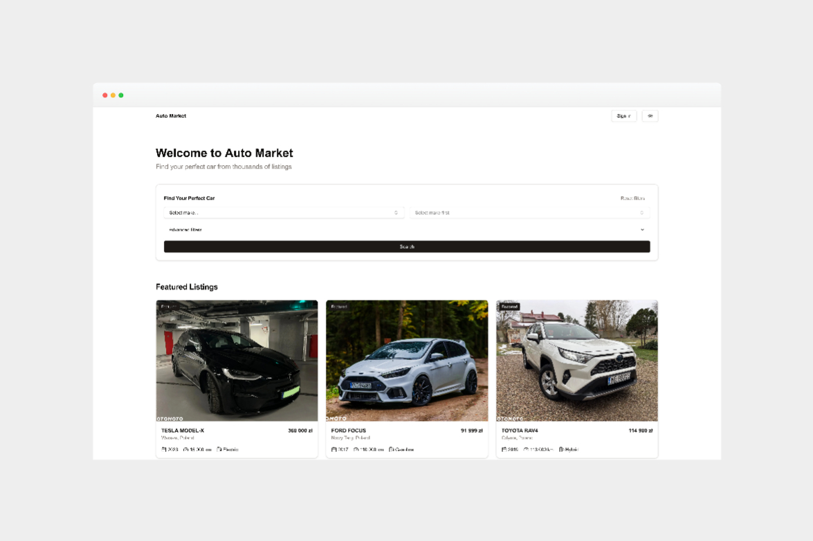

# Auto Market

A modern, production-ready car marketplace built with Next.js 15, featuring secure authentication, real-time database functionality, and a responsive UI.

<div align="center">
  <a href="https://automarkets.netlify.app/" target="_blank">
    
  </a>
</div>

<div align="center">
  
  
  
  
  
  
  
  
</div>

<br />

<div align="center">
  <div>
    <a href="https://automarkets.netlify.app/" target="_blank">
      
    </a>
    <p><em>✨ Live Demo: <a href="https://automarkets.netlify.app/">https://automarkets.netlify.app/</a> ✨</em></p>
  </div>
</div>

## Tech Stack

- **Framework**: [Next.js 15](https://nextjs.org/) with App Router
- **Styling**: [Tailwind CSS](https://tailwindcss.com/)
- **UI Components**: [Radix UI](https://www.radix-ui.com/) + [shadcn/ui](https://ui.shadcn.com/)
- **Authentication**: [Clerk](https://clerk.com/)
- **Database**: [Supabase](https://supabase.com/)
- **Language**: TypeScript
- **Deployment**: Netlify
- **React**: React 19
- **Form Validation**: React Hook Form + Zod

## Core Features

- 🎨 Modern, responsive UI with dark/light mode
- 🔐 Secure authentication with Clerk
- 🛡️ Enhanced API security with route protection
- 📱 Mobile-first design approach
- 🖼️ Image upload and management
- 🔍 Advanced search and filtering
- ⚡ Real-time updates with Supabase
- 🛡️ Row Level Security (RLS)
- 📝 Form validation (React Hook Form + Zod)
- 🚗 Car make/model searchable dropdowns with comprehensive database
- 🖥️ Grid/List view toggle
- ❤️ Favorite listings functionality
- 📊 User dashboard with listings and favorites
- 🔒 Protected routes
- 🌐 SEO optimized with dynamic metadata
- 🎭 Server/Client component separation
- 🔄 Loading states and skeletons
- 🏎️ Car carousel and image gallery
- 📱 Responsive image handling
- 📌 Detailed car specifications display
- 📞 Seller contact information
- 🔗 Social sharing functionality

## Security Features

- Row Level Security (RLS) policies
- Secure authentication with Clerk
- Protected API routes with method-based access control
- Type-safe database queries
- Environment variable validation
- Input validation and sanitization
- CORS and security headers
- API rate limiting

## Project Structure

```
.
├── app/                  # Next.js 15 app directory
│   ├── about/           # About page
│   ├── api/             # API routes
│   ├── cars/           # Car listings and details
│   │   ├── [id]/       # Individual car details
│   │   └── new/        # Add new car listing
│   ├── profile/        # User profile section
│   │   ├── favorites/  # User's favorited cars
│   │   └── listings/   # User's car listings
│   ├── sign-in/        # Authentication pages
│   └── [...]/          # Other app routes
├── components/          # Reusable components
│   ├── auth/           # Authentication components
│   ├── cars/           # Car-related components
│   ├── layout/         # Layout components
│   ├── profile/        # Profile components
│   └── ui/             # UI components (shadcn/ui)
├── lib/                # Utilities and configurations
│   ├── schemas/        # Zod validation schemas
│   └── types/         # TypeScript types
├── public/             # Static assets
└── supabase/          # Database configuration
```

## Database Schema

### Car Makes and Models Tables
```sql
CREATE TABLE car_makes (
  id TEXT PRIMARY KEY,
  name TEXT NOT NULL,
  created_at TIMESTAMPTZ DEFAULT now() NOT NULL
);

CREATE TABLE car_models (
  id TEXT PRIMARY KEY,
  name TEXT NOT NULL,
  make_id TEXT NOT NULL REFERENCES car_makes(id) ON DELETE CASCADE,
  created_at TIMESTAMPTZ DEFAULT now() NOT NULL,
  UNIQUE (id, make_id)
);
```

### Cars Table
```sql
CREATE TABLE cars (
  id UUID PRIMARY KEY DEFAULT uuid_generate_v4(),
  created_at TIMESTAMPTZ DEFAULT now() NOT NULL,
  updated_at TIMESTAMPTZ DEFAULT now() NOT NULL,
  user_id TEXT NOT NULL,
  
  make TEXT NOT NULL REFERENCES car_makes(id),
  model TEXT NOT NULL REFERENCES car_models(id),
  year INTEGER NOT NULL CHECK (year >= 1900 AND year <= EXTRACT(YEAR FROM NOW()) + 1),
  price INTEGER NOT NULL CHECK (price > 0),
  mileage INTEGER NOT NULL CHECK (mileage > 0),
  description TEXT NOT NULL CHECK (length(description) >= 50 AND length(description) <= 6000),
  location TEXT NOT NULL,
  
  condition TEXT NOT NULL CHECK (condition IN ('new', 'used', 'parts')),
  transmission TEXT NOT NULL CHECK (transmission IN ('manual', 'automatic')),
  fuel_type TEXT NOT NULL CHECK (fuel_type IN ('gasoline', 'diesel', 'electric', 'hybrid', 'lpg', 'other')),
  
  has_vin BOOLEAN NOT NULL DEFAULT false,
  vin TEXT CHECK (vin IS NULL OR length(vin) = 17),
  
  is_damaged BOOLEAN NOT NULL DEFAULT false,
  is_imported BOOLEAN NOT NULL DEFAULT false,
  import_country TEXT CHECK (is_imported = false OR import_country IS NOT NULL),
  is_first_owner BOOLEAN NOT NULL DEFAULT false,
  is_accident_free BOOLEAN NOT NULL DEFAULT false,
  is_registered BOOLEAN NOT NULL DEFAULT false,
  is_serviced_at_dealer BOOLEAN NOT NULL DEFAULT false,
  has_tuning BOOLEAN NOT NULL DEFAULT false,
  
  registration_number TEXT DEFAULT '',
  first_registration_date TEXT DEFAULT '',
  show_registration_info BOOLEAN NOT NULL DEFAULT false,

  seller_name TEXT NOT NULL,
  seller_phone TEXT NOT NULL,

  images TEXT[] NOT NULL DEFAULT '{}'
);
```

### User Favorites Table
```sql
CREATE TABLE user_favorites (
  id UUID PRIMARY KEY DEFAULT uuid_generate_v4(),
  user_id TEXT NOT NULL,
  car_id UUID NOT NULL REFERENCES cars(id) ON DELETE CASCADE,
  created_at TIMESTAMPTZ DEFAULT now() NOT NULL,
  UNIQUE(user_id, car_id)
);
```

## Getting Started

1. Clone the repository
2. Install dependencies:
   ```bash
   npm install
   ```

3. Set up environment variables:
   ```env
   # Clerk Authentication
   NEXT_PUBLIC_CLERK_PUBLISHABLE_KEY=
   CLERK_SECRET_KEY=

   # Supabase Configuration
   NEXT_PUBLIC_SUPABASE_URL=
   NEXT_PUBLIC_SUPABASE_ANON_KEY=
   SUPABASE_SERVICE_ROLE_KEY=

   # Application URL (used for CORS)
   NEXT_PUBLIC_URL=
   ```

4. Run the development server:
   ```bash
   npm run dev
   ```

5. Build for production:
   ```bash
   npm run build
   ```

## Performance Optimizations

- Server/Client component separation for optimal React 19 performance
- Image optimization with Next.js Image
- Component-level code splitting
- Efficient data fetching with Supabase
- Responsive image loading
- Dynamic metadata generation
- Loading state skeletons for better UX
- Database query optimization with proper indexes
- Optimized build output with turbopack

## Recent Updates (v1.1.0)

- Upgraded to Next.js 15 and React 19
- Enhanced API security with method-based access control
- Improved database schema with comprehensive car makes/models
- Advanced car listing form with multi-step process
- Server/Client component separation for better performance
- Dynamic metadata generation for better SEO
- Loading state improvements
- Security header enhancements
- Environment variable validation
- Type safety improvements

## License

This project is licensed under the MIT License.

## Version History

### v1.1.0
- Enhanced security features
- Next.js 15 and React 19 compatibility updates
- Performance improvements
- Expanded car database
- Component architecture updates

### v1.0.0
- Initial production release
- Complete car marketplace functionality
- User authentication and profiles
- Real-time updates
- Mobile-responsive design
- Production-ready deployment
